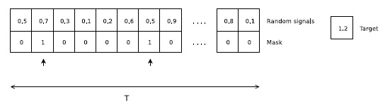
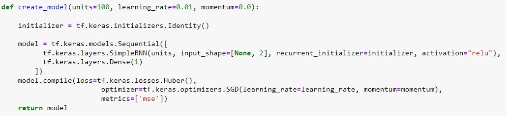
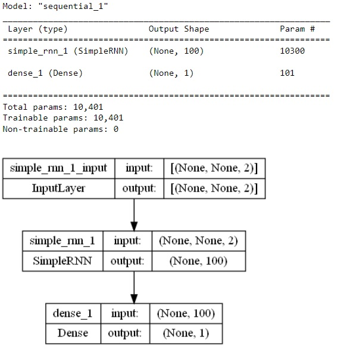
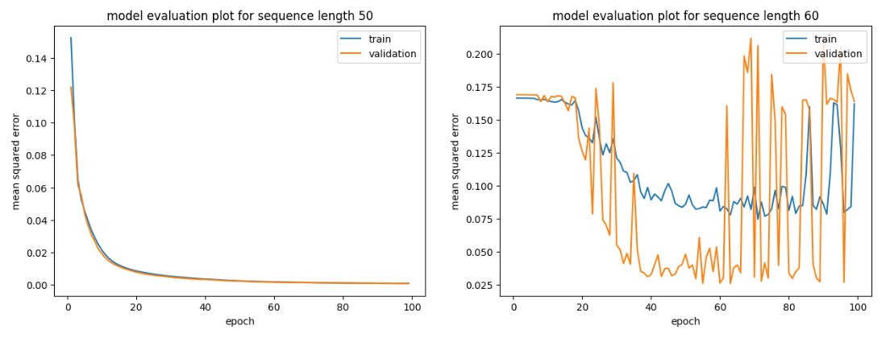
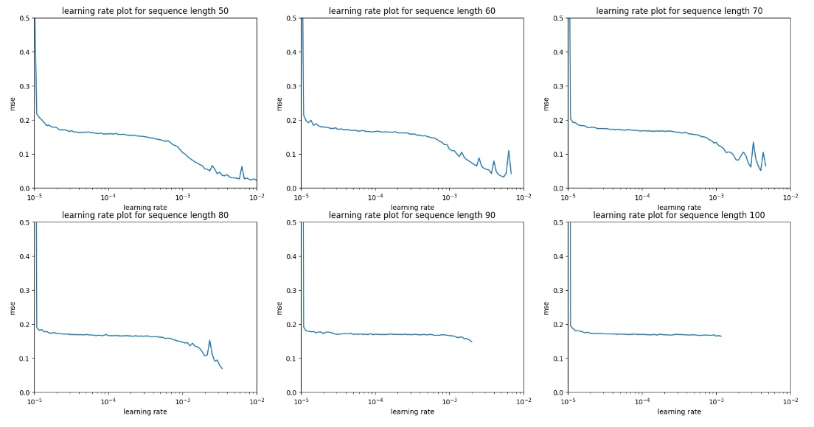
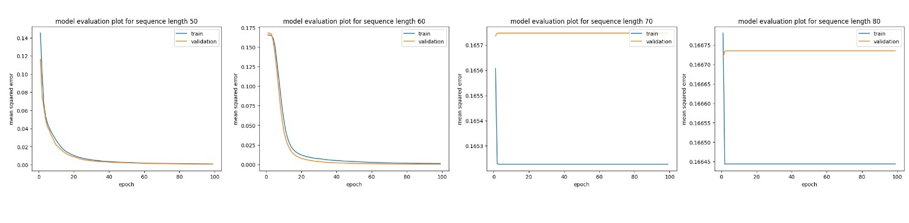
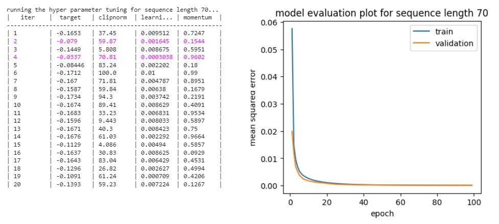
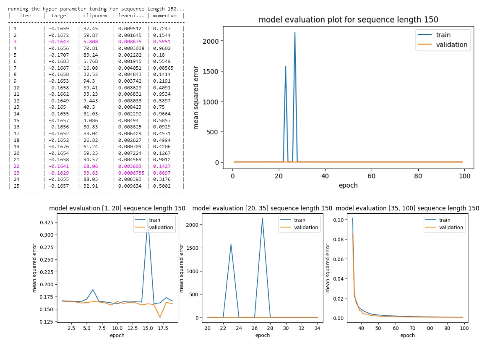
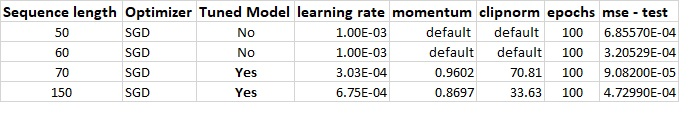

# Recurrent Networks of ReLu Units with Identity Matrix Initializer - Model Evaluation on Adding Problem Dataset

## Introduction

The objective is to train a Sequence Model that learns to compute the sum of two real
numbers. The task is described in detail in "Le et al (2015) - A Simple Way to Initialize
Recurrent Networks of Rectified Linear Units”(https://arxiv.org/pdf/1504.00941.pdf), chapter
4.1. 

The current work provides an evaluation that shows how the model performs depending on
training progress (epochs) as well as input sequence length. It aslo demonstrates that the
model does not exhibit overfitting.

## Adding Problem Datasets

Adding problem datastets are sets of sequences and their target values depending on the length of each sequence.
For the current work, 100,000 samples are generated for training, 10,000 samples for validation and 20,000 samples for testing for each sequence length included in [50, 60, 70, 80, 90, 100]. 

However the packages provides a function to generate a dataset in a flexible way with number of samples needed for training, validation and testing. Even the length of the sequence can be chosen as needed.

## Model

The model proposed in "Le et al (2015)..." is a recurrent network of rectified linear units and identity matrix for the recurrent initializer. As described in chapter 4.1, the adding problem is a sequence regression problem where the target is a sum of
two numbers selected in a sequence of random signals, which are sampled from a uniform distribution
in [0,1]. At every time step, the input consists of a random signal and a mask signal. The mask
signal has a value of zero at all time steps except for two steps when it has values of 1 to indicate
which two numbers should be added. An example of the adding problem is shown in figure 1 below.

The model is very simple: simple reccurent neural network with 100 units, relu activation and reccurent initializer.

Here is the model summary and a view of the model architecture.

Default features of the model are the following:  

- loss: tf.keras.losses.Huber
- optimizer. tf.keras.optimizers.SGD with default parameters
- metrics: mean squared error

Some of these features are subject to parameter tuning when it comes to model optimization in the section Model Evaluation below.
                        
The major advantage of the model is to run faster than other sequence model like LSTM which performs much more computations.

## Model Evaluation

### Solution package

Model evaluation is the core of this work. A package of python functions and classes provides functionality to evaluate the model.

***Python module:***
- adding_problem_model_evaluation.py

***Classes:***
- Adding_Problem_DataGenerator
- Adding_Problem_ModelEvaluator

***Global functions***
- create_simple_model
- create_model
- save_data
- load_data

Description of functions and classes is embedded in the python module.

### Requirements

In order to use this package you need to have following packages installed:
- Python >= 3.7.13
- tensorflow >= 2.9.1
- keras >= 2.9.0
- bayesian-optimization >= 1.3.1
- scikeras >= 0.9.0
- numpy >= 1.21.5

## Installation

The package ***adding_problem_model_evaluation*** is publicly accessible on pypi.

To install the package you need to run following command:

***pip instal adding_problem_model_evaluation***

### Utilization of model evaluation solution

It is shown in Examples.ipynb how to use the functionalities of the package.

## Results of Model Evaluation

   

### Results of model evaluation with default parametrization

For low sequence length up to 50 the model works very good with default parameters. For sequence length from 60 upwards the does not really learn with increasing learning steps. Even between steps 40 and 60 where the mean squared error is below 0.10 the model tends to overfit as the validation set mean squared error is far lower. Hence the model with default parametrization is inappropriate for sequence length from 60 and above.

From the starting point let's check whether better performance could be achieved for sequence length above 60 with selected learning rate depending on sequence length.

### Results of model evaluation with sequence length dependent selected learning rate

In order to selected an appropriate learning rate for the model given a list of sequence lengths [50, 60, 70, 80, 90, 100] let's plot the performance metric mean squared error with regard of learning rate.

Learning rate 1.e-3 appears to be the most appropriate value for all 6 sequence lengths above.

Running the model with learning rate 1.e-3 shows a convergence of all models. But real improvement is shown for the model with sequence length 60. For the model with sequence length 70 or 80 there is no real learning effect with increasing learning step. The performance metric mean squared error for the model with sequence length 70 is arround 0.1652 from learning step 2 until step 100. Similar behavior is observable for the model with sequence length 80 with performance metric mean squared error around 0.1665.

In order to achieve high performance of the model for sequence length from 70 or above, this work provides a parameter tuning functionality with bayesian optimization. 

### Results of model evaluation with sequence length dependent bayesian optimization

For sequence length above 70 the model performs well slightly below mean squared error 0.17. But a better performance could be achieved after tuning the model. The bayesian optimization with cross validation is applied in this work to this end. But model tuning is highly time consumming.

For ***sequence length 70*** the best parameter set is ***{'clipnorm':70.81, 'learning_rate':0.0003038, 'momentum': 0.9602}***.
A very high performance is achieved as shown on the picture right below.

For long sequences, example of ***sequence length 150*** the best parameter set is ***{'clipnorm': 33.63305523122102, 'learning_rate': 0.0006754620538432753, 'momentum': 0.8697291008067327}***. The model is truly struggling for those long sequences. A very high performance is achieved between learning steps 35 and 100 as shown on the picture right below.

## Results summary

The model performs very well with the right learning rate for short to mid-length sequences up to 60. For longer sequences from 70 and above, the performance stays around mse 0.17 (without parameter tuning).

With hyper parameter tuning the model performs very well even for long sequences (at least up to 150).

    

